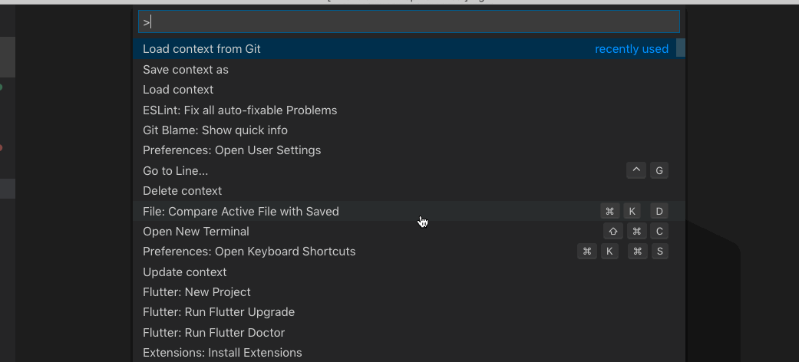
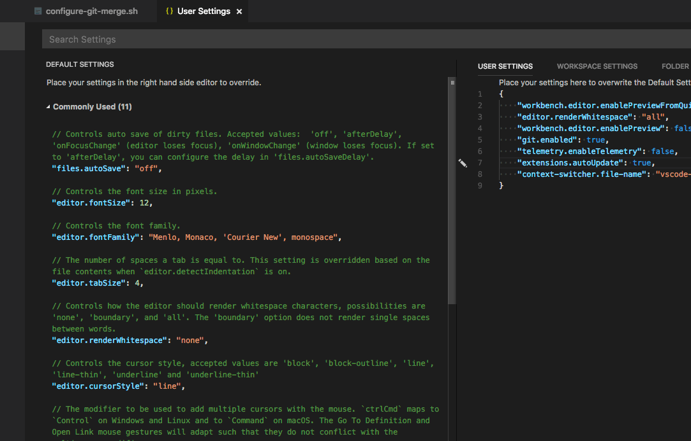

## Features

Enables to store already opened editors under unique identifier. Stored editors can be loaded based on identifier. You have also option to delete stored editors.

## Release Notes

### 0.1.3 Added feature to open files changed in last commit
   * <strong>Load context from Git:</strong> (`Cmd+Shift+P` on OSX or `Ctrl+Shift+P` on Windows and Linux), type <strong>Load context from Git</strong> You will see list of all your repositories.

### 0.1.1
   * fixed issue when stored editors were opened in preview mode which lead to show only last opened editor. (only with preview mode turned on)

### 0.0.6 Added feature to update already opened context
   * added ability to change contexts file without need of reload vscode
   * <strong>Update context:</strong> (`Cmd+Shift+P` on OSX or `Ctrl+Shift+P` on Windows and Linux), type <strong>Update context</strong> Your currently loaded context will be updated.

### 0.0.5

#### Contexts storage file settings
   *  <strong>context-switcher.file-name:</strong> Specifies the name of file which contains stored contexts.
   *  <strong>context-switcher.storage-path:</strong> Specifies the folder path where to store saved contexts.

#### Added basic features:
   * <strong>Save context:</strong> (`Cmd+Shift+P` on OSX or `Ctrl+Shift+P` on Windows and Linux), type <strong>Save context as</strong> You will be prompted to enter name;

   * <strong>Load context:</strong> (`Cmd+Shift+P` on OSX or `Ctrl+Shift+P` on Windows and Linux), type <strong>Load context</strong> You will see list of stored contexts.
   
   * <strong>Delete context:</strong> (`Cmd+Shift+P` on OSX or `Ctrl+Shift+P` on Windows and Linux), type <strong>Delete context</strong> You will see list of stored contexts.

### Save context as

### Load context

### Load context from Git

### Update context

### Delete context

**Enjoy!**
