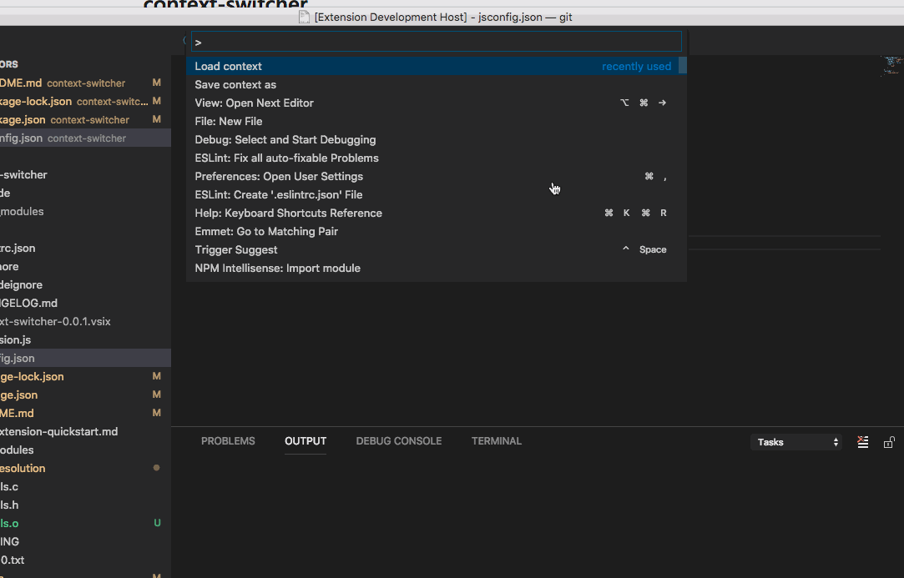
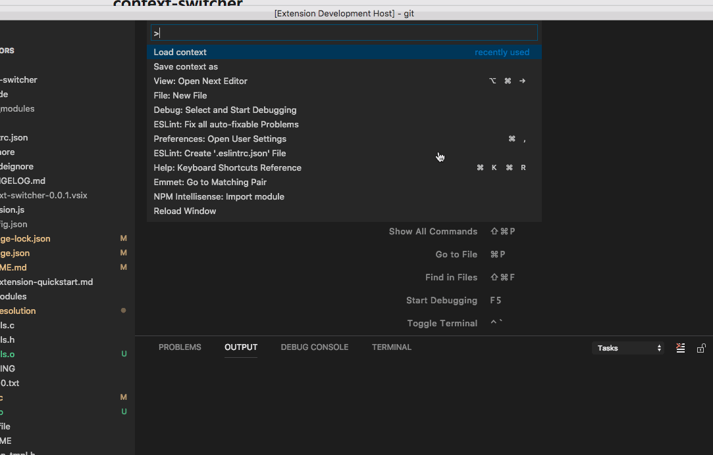
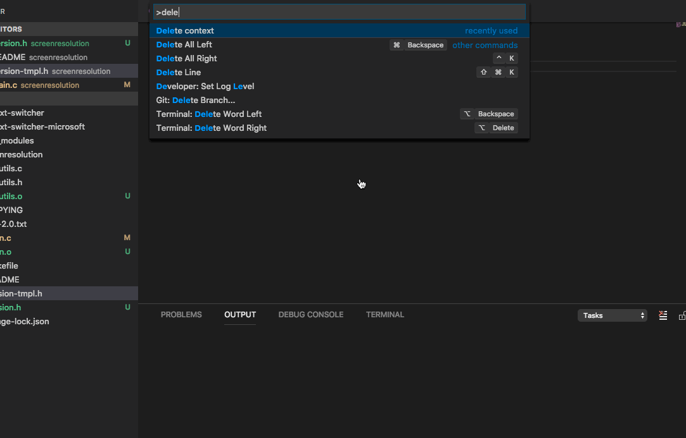

## Features

Enables to store already opened tabs under unique identifier. Stored tabs can be loaded based on identifier. You have also option to delete stored tabs.

## Release Notes

### 0.0.5

#### Added basic features:
   * <strong>Save context:</strong> (`Cmd+Shift+P` on OSX or `Ctrl+Shift+P` on Windows and Linux), type <strong>Save context as</strong> You will be prompted to enter name;

   * <strong>Load context:</strong> (`Cmd+Shift+P` on OSX or `Ctrl+Shift+P` on Windows and Linux), type <strong>Load context</strong> You will see list of stored contexts.
   
   * <strong>Delete context:</strong> (`Cmd+Shift+P` on OSX or `Ctrl+Shift+P` on Windows and Linux), type <strong>Delete context</strong> You will see list of stored contexts.

### Save context as

### Load context

### Delete context

**Enjoy!**
